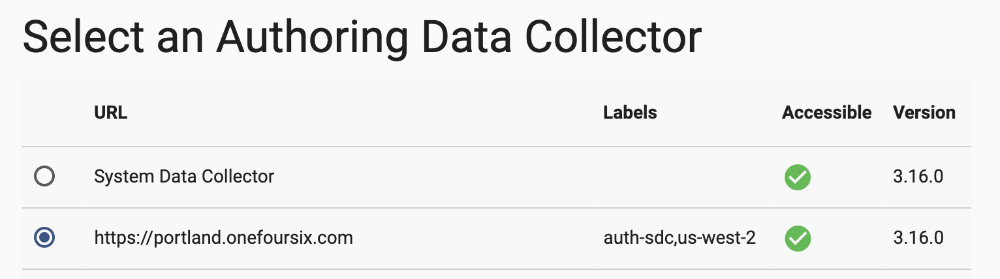

## sdc-on-k8s-with-backend-tls

### Overview

Control Agent currently deploys SDCs configured to use HTTP, not HTTPS (there is an enhacement request to add this support, tracked as DPM-3735). This is generally not an issue, as secure access to SDC instances is typically handled by Ingress Controllers that provide TLS termination and route traffic to backend SDCs using HTTP. 

However, if you want "TLS all the way down" and are not using a Service Mesh that provides [mutual TLS](https://www.istioworkshop.io/11-security/01-mtls/), you will have to manually deploy an Authoring SDC, registered with Control Hub, with the SDC container itself configured for HTTPS.  

The main challenge in manual deployment, rather than using Control Agent, is ensuring that deployed SDC's auth tokens remain valid across SDC Pod death and recreation. (This is one of the main features of Control Agent: watching for new SDC Pods and dynamically generating auth tokens for them.)

This project demonstrates how to deploy a registered SDC configured for HTTPS without using Control Agent while keeping the SDC auth token valid.

A few points to keep in mind:

- This workaround won't be needed once DPM-3735 is resolved

- Although SDC deployment is performed outside of Control Hub, SDC will register with Control Hub and serve as a fully functional Authoring SDC.  

- An Ingress will need to be configured to support [HTTPS as a backend protocol](https://github.com/kubernetes/ingress-nginx/blob/master/docs/user-guide/nginx-configuration/annotations.md#backend-protocol) or [SSL/TLS passthrough](https://kubernetes.github.io/ingress-nginx/user-guide/tls/#ssl-passthrough) depending on your ingress strategy. An example using HTTPS as a backend protocol is provided below.

- Only one instance of SDC per deployment is supported.  This applies whether the Authoring SDC is deployed with Control Agent or not.

### Deploying the Example

- Clone this project to your local machine.

- Identify in advance the URL that will be used to to reach your SDC, which is typically based on the hostname mapped to the external IP of the Ingress Controller. This is required whether one is deploying SDC using a Control Agent or not; it is the value assigned to the <code>SDC_CONF_SDC_BASE_HTTP_URL</code> environment variable in the SDC deployment.

- Create your own keystore to support HTTPS for your SDC. The cert's SAN info should match the hostname or IP address in the SDC URL.

- Edit the file <code>deploy-auth-sdc.sh</code> and set the variables at the top of the file:
  
  Your settings might look like this:

        SCH_ORG=schdemo                
        SCH_URL=https://cloud.streamsets.com         
        SCH_USER=mark@onefoursix           
        SCH_PASSWORD=password123          
        SDC_KEYSTORE_FILE=/Users/mark/certs/keystore.jks      
        SDC_KEYSTORE_PASSWORD=password123   
        KUBE_NAMESPACE=ns1

- Edit the ConfigMap <code>yaml/dpm-configmap.yaml</code> and set the following properties:

  If you are using your own Control Hub rather than <code>https://cloud.streamsets.com</code>, set your own Control Hub URL like this:
  
        dpm.base.url=https://sch.onefoursix.com
  
  Set one or more Labels for the SDC in a comma-delimited string like this:
  
        dpm.remote.control.job.labels=auth-sdc,us-west-2
        
  This ConfigMap will be mounted as <code>$SDC_CONF/dpm.properties</code>
    
- Edit the file <code>yaml/auth-sdc.yaml</code> and set the URL where you will reach SDC. For example, in my environment I have this setting, which matches the URL of my Ingress Controller:
  
        name: SDC_CONF_SDC_BASE_HTTP_URL
        value: "https://portland.onefoursix.com"

  Edit other <code>env</code> settings as needed to set memory and ports for the SDC 
  
- Execute the <code>deploy-auth-sdc.sh</code> script.  

  The script performs the following steps:
  
  - Creates the target namespace if it does not exist
  - Generates an <code>sdc.id</code> and stores it in a Secret
  - Generates a Control Hub auth token for SDC and stores it in a Secret
  - Stores a custom keystore and keystore password in a Secret
  - Creates a ConfigMap to hold <code>dpm.properties</code> values
  - Creates an SDC Deployment with Volume Mounts for the Secrets and ConfigMap
  - Creates a Service for the SDC Deployment
  
   When you run the script you should see output like this:

        $ ./deploy-auth-sdc.sh
        namespace/ns1 created
        Context "mark-aks-1" modified.
        Generated sdc.id 4e5154c7-6201-4974-85be-94d9f2345d2c
        secret/sdc-id created
        Generated an Auth Token for SDC
        secret/sdc-auth-token created
        secret/sdc-keystore created
        configmap/dpm-config created
        deployment.apps/auth-sdc created
        service/auth-sdc created
        
  After a minute or so you should see the registered SDC with an HTTPS URL show up in Control Hub'sExecute >  Data Collector List, with the specified Labels:
  
  
  
  However, you won't be able to reach that SDC in your Browser until you configure ingress for it. 
  
- Configure Ingress for the sdc

  A prerequisite for this step is that you have deployed and configured an Ingress Controller.  For this example I have deployed [NGINX Ingress Controller](https://kubernetes.github.io/ingress-nginx/).
  
  Create an Ingress resource tailored to your Ingress Controller, similar to the example in the file <code>yaml/auth-sdc-ingress.yaml</code> which looks like this:
  
        apiVersion: extensions/v1beta1
        kind: Ingress
        metadata:
          name: auth-sdc
          annotations:
            kubernetes.io/ingress.class: nginx
            nginx.ingress.kubernetes.io/backend-protocol: "HTTPS"
        spec:
          tls:
            - hosts:
              - portland.onefoursix.com
              secretName:  tls-secret
          rules:
          - host: portland.onefoursix.com
            http:
              paths:
              - path: /
                backend:
                  serviceName: auth-sdc
                  servicePort: 18635
                  
  Note the following:
  
  - The <code>nginx</code> Ingress class is specified
  - The backend protocol is set to <code>HTTPS</code>
  - Hosts entries are set for the <code>tls</code> and <code>rules</code>
  - A <code>tls</code> Secret is referenced for secure access to the front end of the Ingress Controller.  
  - The Ingress applies to the Service created above
  
  Finally, one needs to create the mentioned <code>tls</code> Secret in the same namespace as the Ingress.  One can do that with a command like this:
  
        $ kubectl create secret tls tls-secret \
           --key /Users/mark/certs/tls.key \
           --cert /Users/mark/certs/tls.crt     

  Once the Ingress and <code>tls</code> Secret are created, you should be able to reach SDC in your Browser, with a valid certificate:
  
  
    
  And the SDC should be available as an Authoring Data Collector:
  
  
  
- You can test that the SDC's auth token remains valid by deleting the SDC's Pod and waiting for it get recreated.  The new Pod should resume heart-beating to Control Hub and function normally.
   
